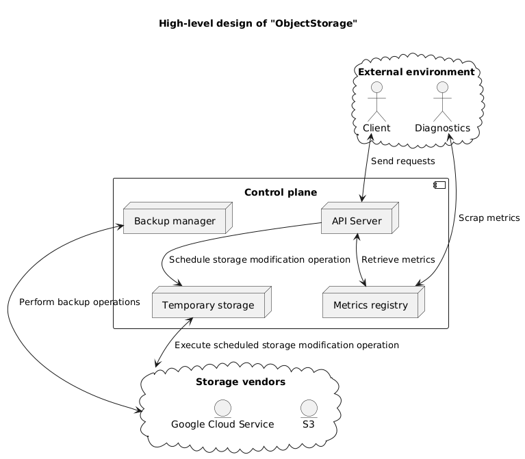

# ObjectStorage

[](https://github.com/YarikRevich/ObjectStorage/actions/workflows/build.yml)


[](https://github.com/vshymanskyy/StandWithUkraine/blob/main/docs/README.md)

## General Information

An object storage with support of **S3** and without vendor limitations.

Features:
* Has easy-to-use well-designed API
* Ignores **S3** limitations(**file size** and **performance**) making interaction with storage vendors seamless
* Provides opportunity to work with different vendors using the same **ObjectStorage** instance
* Has integrated data processing optimizations and excessive monitoring opportunities
* Provides configurable data backups per vendor in the same workspace
* Makes user interaction similar to filesystem

! A mapping of file system to external vendor providers.




## Setup

All setup related operations are processed via **Makefile** placed in the root directory.

### CLI

In order to build **ObjectStorage CLI** it's required to execute the following command. Initially it cleans the environment and builds Java project using **Maven**
```shell
make build-cli
```

After the execution of command given above the executable will be generated and placed into **bin** folder in the root directory of the project

**ObjectStorage CLI** build automatically places default **user.yaml** configuration file into **~/.objectstorage/config** directory.

### API Server

In order to build **ObjectStorage API Server** it's required to execute the following command. Initially it cleans the environment and build Java project using **Maven**
```shell
make build-api-server
```

After the execution of command given above the executable will be generated and placed into **bin** folder in the root directory of the project

## Use cases

For **ObjectStorage CLI** example, there was used the following user configuration file located at **~/.objectstorage/config** directory as **user.yaml**:

For **ObjectStorage API Server** there was used the following configuration file located at **~/.objectstorage/config** directory as **api-server.yaml**:

### Diagnostics dashboard

For **ObjectStorage API Server** configuration the following section should be modified: