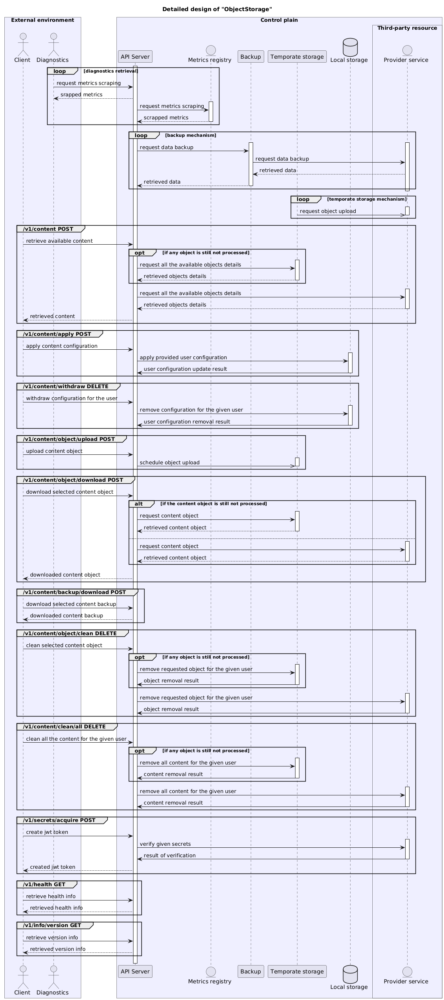
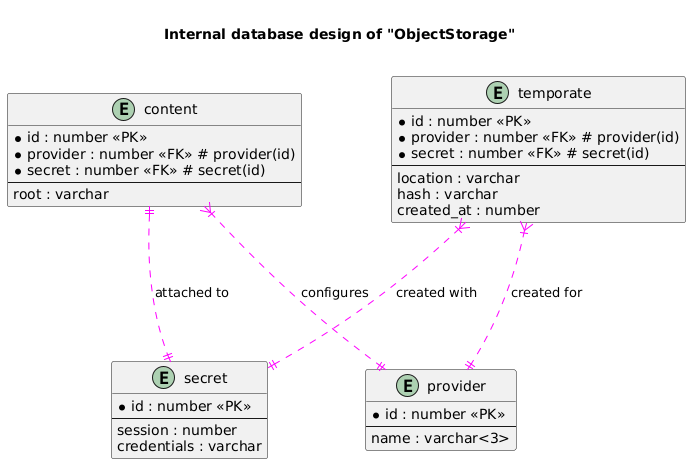

# ObjectStorage

[](https://github.com/YarikRevich/ObjectStorage/actions/workflows/build.yml)


[](https://github.com/vshymanskyy/StandWithUkraine/blob/main/docs/README.md)

## General Information

An object storage with support of **S3** and without vendor limitations.

Features:
* Has easy-to-use well-designed API
* Ignores **S3** limitations(**file size** and **performance**) making interaction with storage vendors seamless
* Provides opportunity to work with different vendors using the same **ObjectStorage** instance
* Has integrated data processing optimizations and excessive monitoring opportunities
* Provides configurable data backups per vendor in the same workspace
* Makes user interaction similar to filesystem







## Setup

All setup related operations are processed via **Makefile** placed in the root directory.

### CLI

In order to build **ObjectStorage CLI** it's required to execute the following command. Initially it cleans the environment and builds Java project using **Maven**
```shell
make build-cli
```

After the execution of command given above the executable will be generated and placed into **bin** folder in the root directory of the project

**ObjectStorage CLI** build automatically places default **user.yaml** configuration file into **~/.objectstorage/config** directory.

### API Server

In order to build **ObjectStorage API Server** it's required to execute the following command. Initially it cleans the environment and build Java project using **Maven**
```shell
make build-api-server
```

After the execution of command given above the executable will be generated and placed into **bin** folder in the root directory of the project

## Use cases

For **ObjectStorage CLI** example, there was used the following user configuration file located at **~/.objectstorage/config** directory as **user.yaml**:
```yaml
# Represents section used to declare file configurations.
content:
  # Represents file system root location, a bucket in the cloud service context.
  root: "/"

# Represents section used for storage provider configuration.
service:
  # Represents selected provider for ObjectStorage. Supported providers are "s3" and "gcs" only.
  - provider: "s3"

    # Represents credentials used for the selected provider.
    credentials:
      # Represents session identificator, used to distinguish different workspaces and thus separate content inside.
      id: "1"

      # Represents a path to the credentials CSV file, which contains both access
      # and secret keys.
      file: "~/.aws/credentials"

      # Represents a select region where the deployment of infrastructure will be performed.
      # Remember that it may influence the availability of the ObjectStorage deployed infrastructure.
      # This option can be applied to "s3" provider only.
      region: "us-west-2"

# Represents section used for ObjectStorage API Server configuration.
api-server:
  # Represents address for the host of ObjectStorage API Server.
  host: "http://localhost:8085"
```

For **ObjectStorage API Server** there was used the following configuration file located at **~/.objectstorage/config** directory as **api-server.yaml**:
```yaml
# Represents section used for ObjectStorage API Server connection configuration.
connection:
  # Represents port of ObjectStorage API Server used for connection establishment.
  port: 8086

  # Represents section used for ObjectStorage API Server security configuration.
  security:
    # Enables security functionality.
    enabled: false

    # Represents path to security certificate key file in JKS format.
    file: "~/test/test.jks"

    # Represents password, which will be used to decode operations.
    password: "test123"

# Represents section used for ObjectStorage API Server temporate storage configuration.
temporate-storage:
  # Represents format used for content to be saved.
  format: "zip"

  # Represents frequency of scheduled operations processing.
  frequency: "*/5 * * * * ?"

# Represents section used for ObjectStorage API Server backup configuration.
backup:
  # Enables backup functionality.
  enabled: true

  # Represents frequency of backup operation for selected provider.
  frequency: "0 */5 * * * ?"

# Represents section used for ObjectStorage API Server diagnostics configuration.
diagnostics:
  # Enables diagnostics functionality.
  enabled: false

  # Represents section used for ObjectStorage diagnostics metrics configuration.
  metrics:
    # Represents port used for metrics endpoint.
    port: 8090

  # Represents section used for ObjectStorage diagnostics Grafana instance.
  grafana:
    # Represents port used for Grafana instance deployment.
    port: 8091

  # Represents section used for ObjectStorage diagnostics Prometheus instance.
  prometheus:
    # Represents port used for Prometheus instance deployment.
    port: 8120

  # Represents section used for ObjectStorage diagnostics Prometheus Node Exporter instance.
  node-exporter:
    # Represents port used for Prometheus Node Exporter instance deployment.
    port: 8121
```

In the **~/.objectstorage/internal/database** directory there will be located internal database data, if **sqlite3** 
option is selected as target database.

### Diagnostics dashboard

For **ObjectStorage API Server** configuration the following section should be modified: